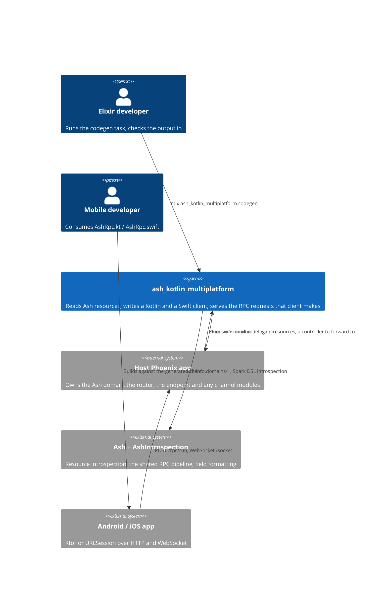
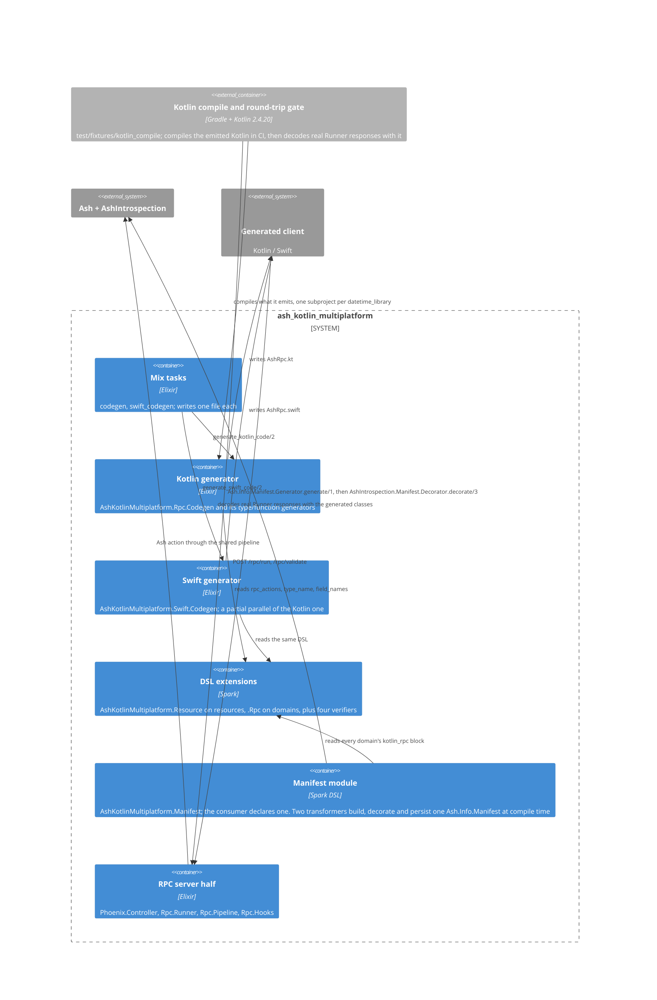
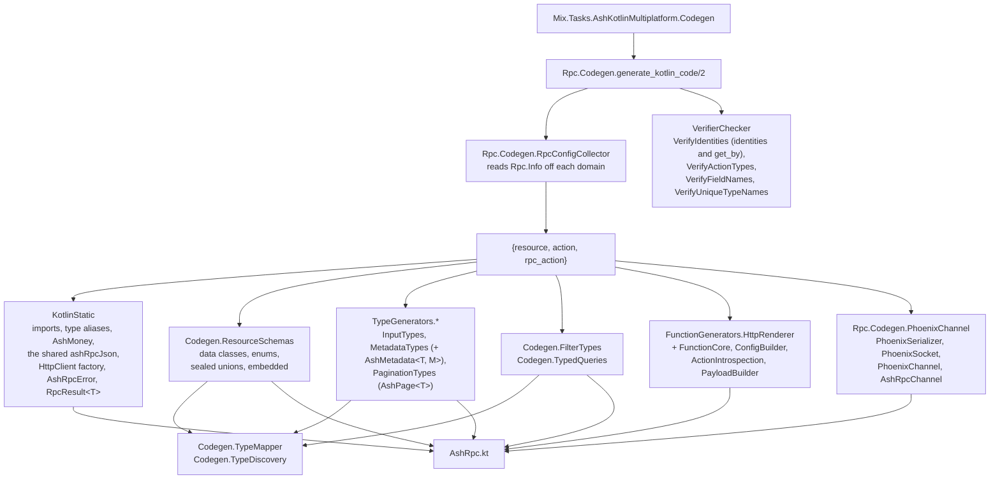
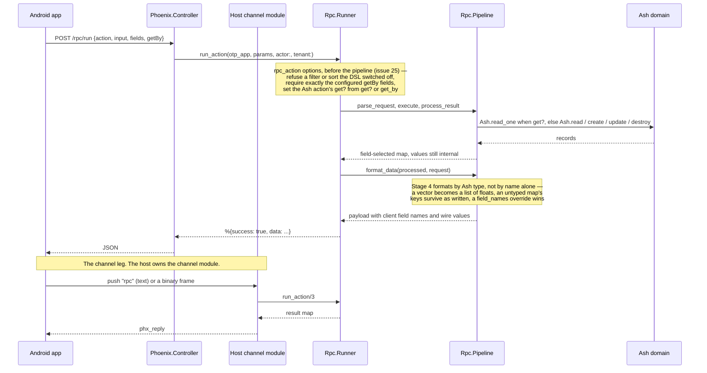
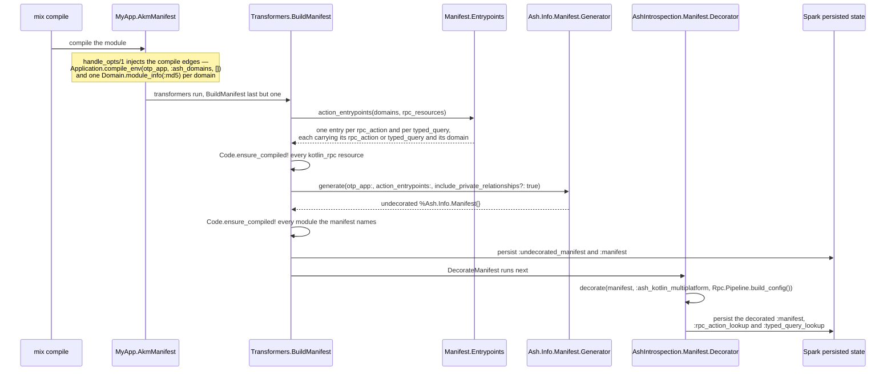

<!--
SPDX-FileCopyrightText: 2025 ash_kotlin_multiplatform contributors

SPDX-License-Identifier: MIT
-->

# Architecture

How an Ash resource becomes a Kotlin or Swift client, and what runs when
that client makes a call. Drawn on 2026-09-09 from the modules that exist in
`lib/`, not from the README, as the source of truth issue #49 asked for.
Read [PROJECT.md](PROJECT.md) first for what the library is. Update the
diagram in the same PR as any change that adds, removes or re-points a
module.

## 1. Context

Two audiences, one shared Ash domain. A developer runs a mix task to write
the client; a mobile app then calls the server the library also provides.



## 2. Containers

The library is one OTP application with two halves that never call each
other. The write half runs at development time and produces text. The serve
half runs at request time inside the host's Phoenix app. They meet only in
the wire contract the generated client encodes.



The gate is drawn because it is the only thing in the repository that checks
the product. Everything else asserts on strings. It has two halves and they
catch different defects: `gradle compileKotlin` catches Kotlin that does not
compile, and `gradle run` catches Kotlin that compiles and then throws or
reads `null` at decode time (#24, #51, #54). A compiler has no opinion about
what a server actually sends, so the second half decodes responses
`Rpc.Runner` produced.

## 3. Component: the Kotlin generator

`Rpc.Codegen.generate_kotlin_code/2` is the only entry point. It collects
config, runs the verifiers, then concatenates section generators in a fixed
order and joins them into one file. Every generator returns a string; none
of them share state.



`HttpRenderer` and `FunctionCore` are drawn in one box, but the arrow that
matters runs between them: `FunctionCore.determine_return_type/1` names the
`T` in the `RpcResult<T>` the function returns, and `HttpRenderer` prints it
into the signature. Ktor resolves `.body()` from that declared type, so this
one string is what makes a response decode into a resource class rather than
a `JsonElement` (#22).

`TypeMapper` and `KotlinStatic` are a pair wherever the mapper names a class
rather than a built-in. `AshMoney.Types.Money` maps to `AshMoney`, and
`KotlinStatic.generate_money_type/0` declares that class in every generated
file — a field typed `AshMoney` in a file that declares none does not compile
(#30). `Ash.Type.Vector`, `AshPostgres.Ltree` and `AshDoubleEntry.ULID` need no
declaration: they map to `List<Double>`, `List<String>` and `String`.

`ConfigBuilder.get_action_context/3` turns the `rpc_action` options into the
context that both `ConfigBuilder` and `PayloadBuilder` read, and the two have
to agree key for key (#25). `get_by` adds a `@Serializable` lookup class —
`FetchAuthorGetBy` for the test domain's `rpc_action :fetch_author` — and a
matching `getBy` line in the payload. `supports_filtering` and
`supports_sorting` are separate context keys, so `enable_filter? false` leaves
`sort` alone. When the two builders disagreed, the emitted Kotlin referenced a
property that was never declared, which is why
`test/ash_kotlin_multiplatform/rpc/codegen/rpc_action_options_codegen_test.exs`
asserts the config class and the payload together.

`VerifyIdentities` checks both ways an `rpc_action` can name a record. On an
update or destroy, every entry in `identities` must be `:_primary_key` or an
identity on the resource; on a read, every field in `get_by` must be a public
attribute, because `ConfigBuilder` takes the lookup class's Kotlin type from
that attribute. Before #25 the DSL had no way to set `identities`, so the
verifier could never fail.

Two things about `PhoenixChannel` that the box does not show. It is
**static**: it takes no resource and no action, so the same text is emitted
for every application, which is issue #35. And it is the only generated code
that owns a wire format of its own rather than delegating to
kotlinx.serialization — see the decision on the v2 serializer.

## 4. Component: the request path

The generated Kotlin has two ways to reach an Ash action, and they converge.
The channel leg is only half in this repository: the library generates the
client but ships no `Phoenix.Channel` module, so the host writes the
`handle_in` that calls `Rpc.Runner`.



The two parameter checks in the note run in `Rpc.Runner.build_request/8`,
before anything reaches the shared core, and each answers with an ordinary
error response rather than a raise. The third is applied a level up, in
`Rpc.Runner.execute_action/7`, and it works differently: a DSL-level `get?`
reaches the core as the *Ash* action's own `get?` field, because
`AshIntrospection.Rpc.Pipeline.execute_read_action/3` branches on that to pick
`Ash.read_one/1` over `Ash.read/1` and builds the query from `action.name`.
Overriding that one field selects the single-record path and nothing else.

`Rpc.Pipeline.build_config/1` is the per-action half of the pipeline config,
and `not_found_error?` is the only key that varies by action. `build_config/0`
used to read that key from
`AshKotlinMultiplatform.warn_on_missing_rpc_config?/0`, a codegen-time warning
switch, so a project that silenced codegen warnings also turned every
not-found into a successful `null`. The field selector and the error builder
still call `build_config/0`; neither reads the key.

## 5. The compile-time manifest pass

Added by issue #73, stage 3 of five in `ash_introspection#23`. It runs once,
when the consumer's manifest module compiles, and it is the only place this
library is meant to introspect a resource. Nothing on the request path reads
its output yet — that is stage 4 — so today the pass is additive and
reversible: delete the module and every read falls back to live introspection.



### Why the compile edges are there

`BuildManifest` finds its domains through `Ash.Info.domains/1`, inside a
transformer, where Elixir's dependency tracker cannot see it. Without explicit
edges, editing a resource recompiles the resource and its domain and leaves the
manifest module alone — and a stale manifest raises nothing. Both edges are
measured rather than assumed, by
`AshKotlinMultiplatform.Manifest.CompileEdgesTest`:

| Edge | Mechanism | Proof |
| ---- | --------- | ----- |
| resource to domain to manifest | `Domain.module_info(:md5)`, a static remote call | `mix xref graph --label compile` shows `todo.ex` to `test_domain.ex (compile)` to `test_manifest.ex (compile)` |
| config to manifest | `Application.compile_env/3` | the source record in `_build/test/lib/ash_kotlin_multiplatform/.mix/compile.elixir` carries `{:ash_kotlin_multiplatform, [:ash_domains], {:ok, [...]}}` |

The middle link of the first row is Ash's, not this library's, so the test
asserts it directly and fails with the instruction to inject a per-resource
edge if Ash ever drops it. No per-resource edge is needed today.

### Why the lookups are not keyed by resource and action

One Ash action can back several client-facing operations —
`rpc_action :list_todos, :read` and `rpc_action :get_todo, :read` are both in
`AshKotlinMultiplatform.Rpc`'s own moduledoc. The generator preserves the
duplicate entrypoints, so `{resource, action}` is not unique here.
`:rpc_action_lookup` and `:typed_query_lookup` are therefore keyed off
`entrypoint.config`, which is the only place a client-facing name exists. See
[decisions.md](decisions.md).

## 6. The Phoenix channel wire format

The generated channel client speaks Phoenix's **v2** serializer,
`Phoenix.Socket.V2.JSONSerializer`, selected by the `vsn=2.0.0` query
parameter the socket appends on connect. The negotiation is in
`deps/phoenix/lib/phoenix/socket.ex:499` and the serializer list in
`deps/phoenix/lib/phoenix/transports/websocket.ex:29`. Absent a `vsn`,
Phoenix falls back to v1, which has no binary branch at all — that is what
the client did before #49, unmarked.

Text frames are a five-element JSON array, not an object:

```
[join_ref, ref, topic, event, payload]
```

Binary frames are length-prefixed, and the layout differs by direction and
kind. Every length is one unsigned byte, so each of those strings is capped
at 255 bytes.

| Direction | Kind | Header bytes | Fields after the header |
| --------- | ---- | ------------ | ----------------------- |
| Client to server | `0` push | `0`, joinRefLen, refLen, topicLen, eventLen | joinRef, ref, topic, event, data |
| Server to client | `0` push | `0`, joinRefLen, topicLen, eventLen | joinRef, topic, event, data (no ref) |
| Server to client | `1` reply | `1`, joinRefLen, refLen, topicLen, statusLen | joinRef, ref, topic, status, data |
| Server to client | `2` broadcast | `2`, topicLen, eventLen | topic, event, data (no refs) |

The outgoing push carries a ref and the incoming push does not, and a reply
puts its status where a push puts its event name. A client that reuses one
layout for both directions misreads every field, and the result is frames
the server drops in silence.

Both directions are emitted by `Rpc.Codegen.PhoenixChannel` as the generated
`PhoenixSerializer` object. The Elixir half of the contract is asserted byte
for byte in
`test/ash_kotlin_multiplatform/rpc/codegen/phoenix_channel_test.exs`,
against the same `Phoenix.Socket.V2.JSONSerializer` that will decode the
frames.

